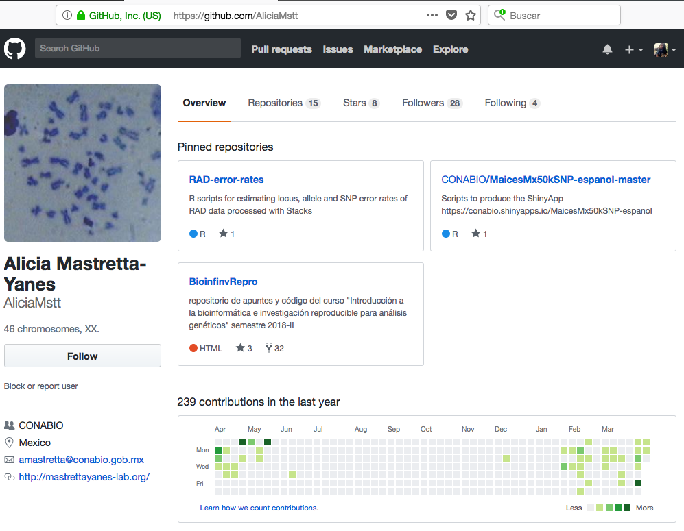
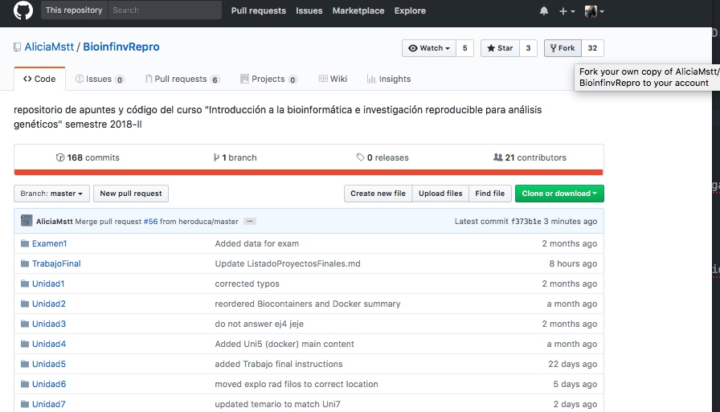
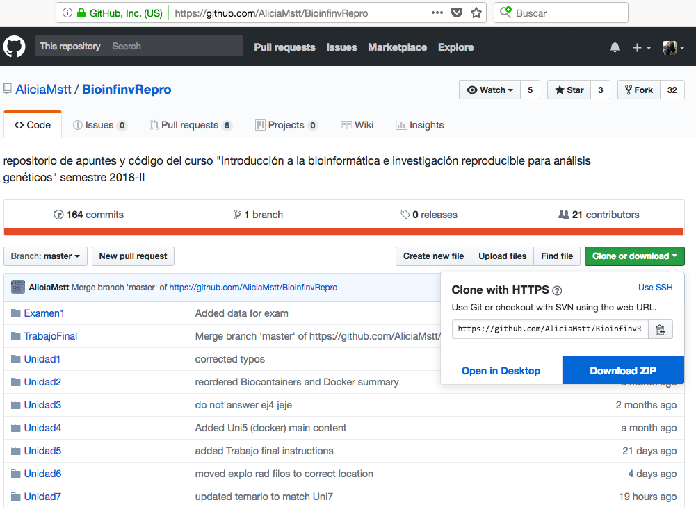
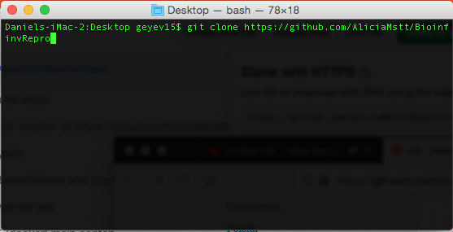
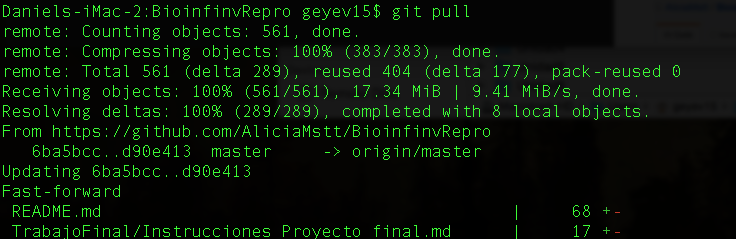

# Tutorial GitHub terminal

### 1.- Primero debes ir al repositorio en el que quieras contribuir.

En este caso nosotros formaremos parte del repositorio de la clase de Bioinformática de la Dra. Alicia Mastretta Yanes. El repositorio se llama BioinfinRepro.



### 2.-Debes tener una copia de este repositorio en tu cuenta

Para ello puedes:

* Dar click en fork y se descargará el directorio del repositorio en tu perfil de GitHub. Este repositorio permanecerá tal y como lo copiaste(fork).





* Entrar a tu terminal e ir directamente al directorio donde quieres descargar el repositorio. Una vez ubicado en el lugar de descarga usaras el comando git clone y el url del repositorio.

```
git clone
```



### 3.- Debes actualizar los cambios que hagan los dueños del repositorio.

Para ello puedes:

* Ir al directorio donde se encuentra el repositorio que descargaste. Con esto se actualizará el repositorio en tu computadora pero no en tu cuenta en linea

```
git pull
```



Para mantener actualizado un repositorio forkeado debes:
