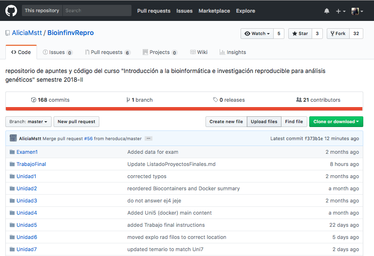

# Tutorial GitHub Online

### 1.- Primero debes ir al repositorio en el que quieras contribuir.

En este caso nosotros formaremos parte del repositorio de la clase de Bioinformática de la Dra. Alicia Mastretta Yanes. El repositorio se llama BioinfinRepro.

### 2.-Debes tener una copia de este repositorio en tu cuenta

Para ello puedes:

* Dar click en fork y se descargará el directorio del repositorio en tu perfil de GitHub. Este repositorio permanecerá tal y como lo copiaste(fork).

### 3.- Puedes contribuir con archivos en el repositorio.

Para ello puedes:

* Ir al directorio donde deseas realizar los cambios y editar un archivo. Dando click en el lápiz.

* O puedes agregar imagenes, archivos, directorios, etc. Dando click en upload files.

### 4.- Mantener actualizado un repositorio forkeado.

Para ello debes:

Comentar y participar en la edición de ese repositorio. También puedes eliminar el repositorio y volver a copiarlo (fork).
